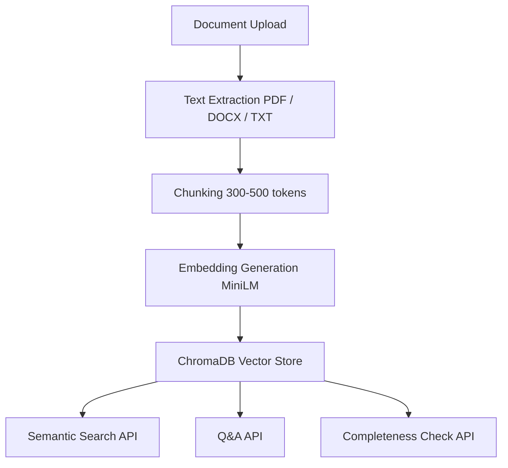

# RAG Service  
**AI-Powered Knowledge Base Search & Enrichment (Wand AI Challenge)**  

---

## Overview

`rag-service` is a modular **FastAPI backend** implementing a complete **Retrieval-Augmented Generation (RAG)** pipeline.  
It enables users to:
- Ingest documents (PDF/DOCX/TXT)  
- Perform semantic search  
- Ask natural language questions (Q&A)  
- Evaluate topic completeness  

The system stores both **raw text** and **vector embeddings**, allowing AI-assisted retrieval and reasoning across thousands of documents.

---

## Architecture



## Folder Structure
```
rag-service/
│
├── app/
│   ├── main.py
│   ├── api/
│   │   ├── ingest.py
│   │   ├── query.py
│   │   ├── qa.py
│   │   └── completeness.py
│   ├── services/
│   │   ├── embeddings.py
│   │   ├── vector_store.py
│   │   ├── text_extractor.py
│   │   ├── chunker.py
│   │   └── qa_service.py
│   └── core/
│       ├── config.py
│       └── logger.py
│       └── db.py
│
├── data/
│   ├── raw_uploads/
│   └── chromadb/
│
├── requirements.txt
└── README.md
```

## Setup & Run

### 1. Clone the repository
```bash
git clone https://github.com/Sunil1208/rag-service.git
cd rag-service
```

### 2. Create and activate a virtual environment
```bash
python3 -m venv venv
source venv/bin/activate        # Windows: venv\Scripts\activate
```

### 3. Install dependencies
```bash
pip install --upgrade pip
pip install -r requirements.txt
```

### 4. Run the FastAPI server
```bash
uvicorn app.main:app --reload
```

Open interactive docs: http://127.0.0.1:8000/docs


## API Endpoints

| Endpoint                  | Method    | Description                                   |
| :------------------------ | :------:  | :-------------------------------------------- |
| /api/v1/ingest            |   POST    | Upload a document → extract + embed + store   |
| /api/v1/query             |   GET     | Retrieve semantically relevant chunks         |
| /api/v1/qa                |   GET     | Generate concise answer from context          |
| /api/v1/completeness      |   POST    | Evaluate topic coverage in a document         |


## Example Usage
1. Ingest Document

```bash
curl --location 'http://127.0.0.1:8000/api/v1/ingest' \
--form 'file=@"/C:/Users/Downloads/HR-Policies-Manuals.pdf"'
```

Response
```bash
{
    "document_id": "f5384fc1-438c-4611-aa1d-c8d84d8ce175",
    "filename": "HR-Policies-Manuals.pdf",
    "total_chunks": 88,
    "sample_chunk": "SPIL Corporate HR Policies SIRCA PAINTS INDIA LTD NEW DELHI CORPORATE HUMAN RESOURCES  POLICIES & MANUALS SPIL Corporate HR Policies Section 1: Introduction This handbook is the summary of the policies, procedures, guidance and benefits to the employees and organization. It is an introduction to our vision, mission, values, what you expect from us and what we expect from you. We believe that employees are the assets of the organization and to understand them the posi tive work environment play an"
}
```

2. Semantic Query

```bash
curl --location 'http://127.0.0.1:8000/api/v1/query?q=Grievance%20Redressal%20Mechanism&top_k=3'
```

Response
```bash
{
    "query": "Grievance Redressal Mechanism",
    "top_k": 2,
    "results": [
        {
            "document_id": "aa462463-404a-438f-b1df-858edbb27e96",
            "filename": "HR-Policies-Manuals.pdf",
            "text": "officer/cell. f) If a satisfactory resolution is not obtained by the escalation officers, then the grievance will forwarded to the Director/Managing Director. SPIL Corporate HR Policies PROCEDURE FOR GRIEVANCE REDRESSAL CELL Complaint Registered to HR Department Identification of Problem/Grievances Collection of Facts/Evidences Analyzing and solving the cause of Grievances Prepare the Report and submit to Management Implementation and Follow up For the above, Employee Counselin g plays an",
            "score": 0.8215
        },
        {
            "document_id": "aa462463-404a-438f-b1df-858edbb27e96",
            "filename": "HR-Policies-Manuals.pdf",
            "text": "Department with the concerned person Name and Designation. c) The complaint includes the detailed description of the incidence. The Human Resources Department will take the prompt actio n on the complaint. d) The Human Resources Department will take the detail from the Reporting Officer and search for the relevant evidence of the said grievance. e) The Human Resources Representative will prepare the grievance report within 2 days of the submission of complaint and s ubmit to the next escalation",
            "score": 0.8971
        }
    ]
}
```

3. Semantic Query

```bash
curl --location 'http://127.0.0.1:8000/api/v1/qa?q=Who%20evaluates%20performance%20during%20probation%3F&top_k=2'
```

Response
```bash
{
    "query": "Who evaluates performance during probation?",
    "answer": "The Department Head",
    "sources": [
        "Feedback a) After the training session, the employee has to submit the evaluator’s feedback to the organization. b) The Department Head will evaluate the employee after the particular training session on quarterly basis and submit the report to the HR Department. c) After the particular session, if the employee becomes the high -potential and benefit to the organization, then the additional incentive will be given. Section 5: Probation and Confirmation Probation : a) The probation period is the",
        "Employee has to earn the minimum category of “Average” and maximum category of “Excellent” for the confirmation. e) Depend upon the performance of the probationers and discretion of the management, the probationer’s compensation, grade, designation can be reviewed for motivation and better productivity. f) If the category earn was below “Average” then the extension for t he probation of minimum of 1 month and maximum of 3 months will be issued. g) The employee has to submit the acknowledgement"
    ]
}
```

4. Completeness Check

```bash
curl --location 'http://127.0.0.1:8000/api/v1/completeness' \
--header 'Content-Type: application/json' \
--data '{
    "topics": ["probation", "cash reward"],
    "document_id": "aa462463-404a-438f-b1df-858edbb27e96"
}'
```

Response
```bash
{
    "document_id": "aa462463-404a-438f-b1df-858edbb27e96",
    "covered": [
        "probation"
    ],
    "missing": [],
    "coverage": 50.0
}
```


## Design Decisions

| Area                  | Decision                  | Rationale                             |
| :-------------------  | :-----------------------  | :------------------------------------ |
| Framework             |   FastAPI                 | Async, modern, OpenAPI support        |
| Vector DB             |   Chroma PersistentClient | Lightweight + on-disk persistence     |
| Embeddings            |   all-MiniLM-L6-v2        | Compact & accurate semantic vectors   |
| LLM (Q&A)             |   google/flan-t5-small    | Small local model (no API costs)      |
| Deduplication         |   File SHA-256 hash       | Prevents duplicate ingestion          |
| Incremental Updates   |   Re-index on hash change | Enables smart updates                 |
| Batch Embeddings      |   .encode(batch_size=32)  | 3–5× faster processing                |
| Persistence           |   Chroma + SQLite         | Simple local storage                  |


## Trade-offs

| Current Limit | Future Improvement |
|----------------|--------------------|
| Local models → limited fluency | Integrate OpenAI GPT-4o-mini or Claude |
| Synchronous ingestion | Async Celery / Redis pipeline |
| Memory read for files | Switch to streaming hash + save |
| Limited tests | Add pytest + HTTPX API tests |
| Backend-only | Add Streamlit/React demo UI |

## Tech Stack

| Layer | Technology |
|--------|-------------|
| Backend | FastAPI |
| Vector Store | ChromaDB |
| Embeddings | SentenceTransformer MiniLM |
| LLM (Q&A) | Flan-T5 Small |
| Logging | Loguru |
| Language | Python 3.10+ |